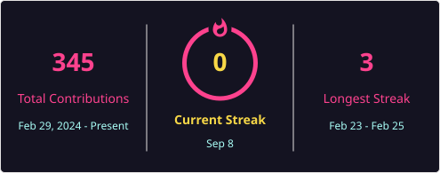

<div align="center">


</div>

<br>

```bash
$ whoami
> Pedro Henrique Mendes de Jesus

$ cat objetivo.txt
> Busco minha primeira oportunidade profissional na área de tecnologia,
> para colocar em prática o que venho estudando, ganhar experiência real
> e crescer como desenvolvedor.

$ echo $STATUS
> [ONLINE] Disponível para novas oportunidades_
```

<br>

## `01` FORMAÇÃO_ACADÊMICA

```
[2026 — 2028]  Tecnólogo em Análise e Desenvolvimento de Sistemas
               Faculdade SENAI Ribeirão Preto  ·  cursando ▓▓▓▓▓▓░░░░ 

[2024 — 2026]  Técnico em Desenvolvimento de Sistemas
               SENAI Sertãozinho  ·  concluído ▓▓▓▓▓▓▓▓▓▓

[  2025    ]  Ensino Médio
               SESI CE-241  ·  concluído ▓▓▓▓▓▓▓▓▓▓
```

## `02` CERTIFICAÇÕES

<details>
<summary>▸ <b>PROGRAMAÇÃO</b></summary>
<br>

- ⟨/⟩ Lógica de Programação
- ⟨/⟩ Administração de Banco de Dados

</details>

<details>
<summary>▸ <b>SEGURANÇA & DADOS</b></summary>
<br>

- 🔒 Cibersegurança na Nuvem
- 🔒 Por Dentro da Segurança Cibernética
- 🔒 LGPD

</details>

<details>
<summary>▸ <b>INTELIGÊNCIA ARTIFICIAL</b></summary>
<br>

- 🤖 Fundamentos da IA
- 🤖 Ética na IA

</details>

<details>
<summary>▸ <b>INFRAESTRUTURA & EXTRAS</b></summary>
<br>

- 🖥️ Desvendando Data Centers
- 📡 Desvendando o 5G
- 📊 Excel Básico
- 🚀 Empreender SENAI
- ♻️ Economia Circular

</details>

<sub>* Todas as certificações concluídas pelo SENAI.</sub>

## `03` ROBÓTICA & PRÊMIOS

> 6 anos de participação em competições de robótica escolar em nível nacional, incluindo 3 anos como integrante da equipe **FRC Steel Bulls 9460**, onde trabalhei no **Project Bull AI** — integração de Inteligência Artificial em projetos de robótica.

`🏆` Rookie Inspiration Award — *Brasília*
`🏆` Finalist Award — *Brasília*
`🏆` Quality Award — *São Paulo, Reefscape*

## `04` TECH_STACK

<div align="center">


</div>

<sub>Também tenho base em suporte técnico, hardware e redes.</sub>

## `05` IDIOMAS

`🇧🇷` Português `[ Nativo ▓▓▓▓▓▓▓▓▓▓ ]`
`🇺🇸` Inglês `[ Intermediário ▓▓▓▓▓▓░░░░ ]`

## `06` SYSTEM_STATS

<div align="center">


<br>



</div>

## `07` CONNECT

<div align="center">

[](https://www.linkedin.com/in/pedro-jesus-aa4018383/)
[](mailto:pedroh.mendes472@gmail.com)
[](https://www.instagram.com/pedro_mjay)

</div>

<div align="center">
<sub><i>"Always curious, always learning." ⚡</i></sub>
</div>


